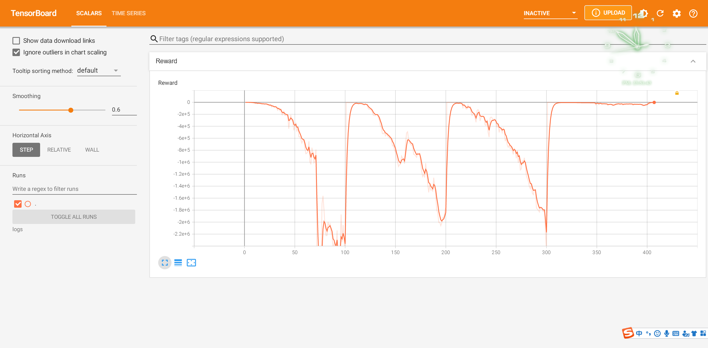

## README
* 数据结构请查看scheduling_env.py


## Algorithm+
* State:
    * t_suspended, Project_priority_normalisation_index,list.number,
    * 任务花费时间：t_spent1, t_spent2, t_spent3, t_spent4, t_spent5,
    * 如果送进该机器的时间延迟：t_balance1, t_balance2, t_balance3, t_balance4, t_balance5,
    * 机器剩余时间：machine1_time_left, machine2_time_left,  machine3_time_left, machine4_time_left, machine5_time_left,
    * 机器上正在做的任务如果完成了的时间延迟：machine1_balance， machine2_balance， machine3_balance， machine4_balance， machine5_balance,
* Action: 5 + 45
---
* 时间循环：0,225,0.01
    * 新来了Job
        * Get_state -> Agent -> Action -> 环境更新 -> reward, next-state
    * 更新所有机器剩余时间
        * 有机器空闲
            * list不空：
                * 取出最优先任务 -> Get_state -> Agent -> Action -> 环境更新 -> reward, next-state
            * list空：
                * do nothing
    * 循环结束，即T = 225
* agent(state)
    * epsilon-greedy 选择action
* 环境更新
    * action = 0 - 4:
        * reward = 任务放进这个机器的时间结余
	* action = 5 - 49:
		* 放进waiting_list
    * return reward


## Result



## 伪代码文字
```
训练循环
	环境 = 0 
	时间循环
		list中每个数组第2位+0.01
		判断 如果T_Environment=新任务到达
			赋值 环境 = 新任务
			给agent(state)
			reward=0
			
		机器.剩余时间更新
		5次循环 
			如果机器j.剩余时间 < 0
				如果 list 非空
					取出list最优先的
					给agent
					reward = machine j_balance （如果为负数）
					（如果为正，说明任务没超期reward=0),
					  (如果时间>175，额外减）//待商议和测试
				 如果 List空 且 machine j时间结余为0
					do nothing
				如果 List空 且 machine j时间结余不为0
					环境 = 垃圾
					给agent，agent只能留给list
					reward = machine j_balance
				machine j_balance = 0

agent(state)
	缓存这个state为state0
	epsilon-greedy 选择action

环境更新
    reward = 0
	如果 action = m1
		如果 所需执行时间是负数
			把state0还给agent，reward += -100
		如果 机器1剩余任务时间是正
			把state0还给agent，reward += -100
		else
			reward = 机器1的时间结余
	如果 action = 0~44
		list，新建项目
    return reward
```


## Log
* 9.13 已经改完所有已知bug，Tag:0913
    * 除了:T结束，waiting_list还剩任务，没有结算，据观察一般来说没有，之前是因为mask的bug(5个0)导致任务无法分配机器
    * 已修改的bug:
        * mask不会出现5个0，以至于无机器可以放
        * 每个epoch开始，reset环境，包括jobs，machines，waiting_list
        

## Todo:
* 校验 reward == tardness
* 优先级一样，按照什么排？
* T结束，结算 waiting_list
* 修改 tensorboard:
    * train:loss/ep_reward/last_reward
    * valid:loss/ep_reward/last_reward
* 添加baseline，FIFO，先进先出
* 修改随机机制，每个epoch开始随机100个任务，任务花费时间不变